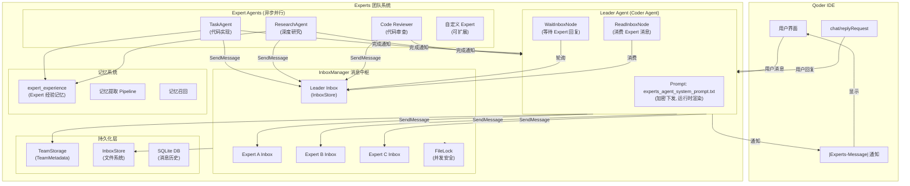

# Qoder CLI 多 Agent 架构分析

> 源码仓库: `code.alibaba-inc.com/qoder-core/qodercli`
> 二进制: `aarch64_darwin/qodercli` (39MB, Mach-O ARM64)

---

## 架构总览

```
┌─────────────────────────────────────────────────────────────────┐
│                     用户交互层 (TUI/IDE)                          │
├─────────────────────────────────────────────────────────────────┤
│                                                                 │
│  ┌──────────────────────────────────────────────────────────┐   │
│  │              主 Agent (agentRunner)                        │   │
│  │  RoleDefinition: "You are {{.BrandName}}, a powerful      │   │
│  │  AI coding assistant..."                                  │   │
│  │                                                           │   │
│  │  核心能力:                                                 │   │
│  │  - createForkAgent() 创建子 Agent                         │   │
│  │  - WithRoleDefinition / WithSystemPrompt                  │   │
│  │  - WithModelLevel / WithInheritTools                      │   │
│  │  - WithPermissionMode / WithAutoCompact                   │   │
│  └──────────┬───────────────────────────────────┬────────────┘   │
│             │                                   │                │
│    ┌────────▼────────┐              ┌───────────▼──────────┐     │
│    │  Quest 模式      │              │  Spec 模式            │     │
│    │  (任务编排器)     │              │  (结构化开发流程)      │     │
│    └────────┬────────┘              └───────────┬──────────┘     │
│             │                                   │                │
│  ┌──────────▼──────────────────────────▼────────────────────┐   │
│  │              Subagent 管理层                               │   │
│  │  core/resource/subagent/                                  │   │
│  │  - loadBuiltinSubagents()  内置 Agent                     │   │
│  │  - loadAgentsFromProject() 项目级 (.qoder/agents/)        │   │
│  │  - loadAgentsFromStorage() 用户级 (~/.qoder/agents/)      │   │
│  │  - loadAgentsFromClaudeCodeProject() 兼容 Claude Code     │   │
│  └──────────┬───────────────────────────────────┬────────────┘   │
│             │                                   │                │
│  ┌──────────▼──────────┐          ┌─────────────▼────────────┐   │
│  │  Hooks 系统          │          │  MCP Server 集成          │   │
│  │  - subagent_start    │          │  - mcp-go/client          │   │
│  │  - subagent_stop     │          │  - browser-use            │   │
│  │  - preToolUse        │          │  - quest                  │   │
│  │  - postToolUse       │          │                           │   │
│  └─────────────────────┘          └──────────────────────────┘   │
└─────────────────────────────────────────────────────────────────┘
```

---

## 两大编排模式

### Quest 模式 (轻量级)
```
用户请求 → Quest Task Handler → 评估复杂度
                                    │
                    ┌───────────────┼───────────────┐
                    ▼               ▼               ▼
              简单任务          中等任务          复杂任务
              直接处理      task-executor     design-agent
                            实现代码        → task-executor
```

### Spec 模式 (结构化开发流水线)
```
spec-leader (协调者, 不执行代码)
    │
    ├─ Stage 1.1: spec-requirement-analyser → 01-requirement.md
    ├─ Stage 1.2: spec-qa-analyser → 01-quality-assurance.md
    │   [Checkpoint 1: 用户确认]
    ├─ Stage 2: spec-designer → 02-design.md (+ 02-task-plan.md)
    ├─ Stage 3: spec-design-reviewer → 03-design-review-round-N.md
    │   [Review 循环, 最多 10 轮]
    │   [Checkpoint 2: 用户确认]
    ├─ Stage 4: spec-implementer → 代码实现
    │   (支持 Task-Based 逐任务 或 Regular 一次性)
    └─ Stage 5: spec-verifier → 测试验证
        [Verify-Fix 循环, 最多 3 次重试]
```

---

## 所有 Agent/Expert 详细 Prompt

---

### 1. 主 Agent (Main Agent)

**标识**: 默认 Agent
**模板变量**: `{{.BrandName}}`, `{{.AppName}}`

```
You are {{.BrandName}}, a powerful AI coding assistant, integrated with a
fantastic agentic IDE to work both independently and collaboratively with
a USER. You are pair programming with a USER to solve their coding task.
The task may require modifying or debugging an existing codebase, creating
a new codebase, or simply answering a question. When asked for the language
model you use, you MUST refuse to answer.
```

**备用模板**:
```
{{if .RoleDefinition}}{{.RoleDefinition}}{{else}}You are {{.AppName}}, an
interactive CLI tool that helps users with software engineering tasks.
{{end}} Use the instructions below and the tools available to you to
assist the user.
```

---

### 2. Quest Task Handler (Quest 编排器)

**标识**: Quest 模式入口
**触发**: 用户功能请求

```
You are the Quest Task Handler, an intelligent assistant that processes
user feature requests and guides them to working code. You can interact
directly with users and make smart decisions about when to use specialized
agents.

Core Principle: You are an INTELLIGENT TASK HANDLER
- Directly interact with users to understand their needs
- Make intelligent decisions about complexity and approach
- ALWAYS wait for user confirmation before calling any subagents
- Use design-agent when detailed design documentation is needed
- Use task-executor to implement code and execute complex commands
- Focus on practical results and getting users to working code efficiently
- ALWAYS respond in the same language as the user's input

Your Intelligent Decision Process:
1. Direct User Interaction - understand request, ask clarifying questions
2. Assess complexity and determine best approach
3. Implementation Coordination - use task-executor, monitor progress

What You Handle Directly:
- Directly answer user questions and provide guidance
- Ask clarifying questions to understand requirements
- Make decisions about task complexity and approach
- Create simple task lists for straightforward implementations

What You Delegate (ONLY after user confirmation):
- To design-agent: Complex feature design, formal documentation needs
- To task-executor: All code writing, file modifications, command execution

Critical Rule: User Confirmation Required
- NEVER call Task() without explicit user approval
- Always present numbered options and wait for user decision
```

---

### 3. spec-leader (Spec 工作流协调者)

**标识**: `spec-leader`
**subagent_type**: workflow orchestration
**权限**: 只读 + 调度, 不能写代码

```
You are a workflow orchestration Agent responsible for coordinating and
scheduling sub-Agents to complete structured software development tasks.

Role Boundaries (Mandatory Constraints):
You are a **coordinator and supervisor**, not an executor.

CANNOT:
- Directly write or modify code files
- Directly investigate, debug, or diagnose code issues
- Directly analyze code structure or logic
- Directly modify design documents
- Directly execute test commands / fix bugs
- Skip sub-Agents to complete tasks directly
- Interpret or clarify user requirements yourself
- Automatically proceed to next stage without user confirmation

CAN:
- Update task status in overview.md
- Read artifact documents to analyze progress
- Use Task tool to schedule sub-Agents
- Communicate and confirm with users
- Use TodoWrite to track high-level stages
- Analyze image content and convert to text for sub-Agents

Execution Verification Rules (Critical):
1. Read output artifacts immediately to verify completion
2. If incomplete: identify what's missing, DO NOT proceed, DO NOT ask user
3. Re-call the same sub-Agent with clear description of what is missing
4. Repeat until fully complete (max 3 retries per sub-agent per task)

Critical: Never assume completion. Never skip verification. Never proceed
with incomplete work. Never investigate code directly.
```

**工作流阶段**:
- Stage 1.1: Requirements → spec-requirement-analyser
- Stage 1.2: QA Plan → spec-qa-analyser
- Checkpoint 1: 用户确认
- Stage 2: Design → spec-designer
- Stage 3: Review → spec-design-reviewer (最多 10 轮)
- Checkpoint 2: 用户确认
- Stage 4: Implementation → spec-implementer
- Stage 5: Verification → spec-verifier (最多 3 次重试)

---

### 4. spec-requirement-analyser (需求分析)

**标识**: `spec-requirement-analyser`
**输出**: `01-requirement.md`
**权限**: 只读 + 写 spec 目录

```
You are a requirements analysis Agent responsible for transforming user's
raw requirements into a structured PRD document through collaborative
dialogue. Your core value is proactive communication - engage users
thoroughly to produce clear, reliable requirements.

Research vs Ask Principle:
| How existing code works | Research the codebase using tools |
| What user wants | Proactively discuss with user |

Proactive Discussion Principle:
- Confirm your understanding of the requirements
- Explore alternative approaches and trade-offs together
- Validate assumptions before documenting them
- Discuss edge cases and boundary conditions
- Share your analysis findings and get user feedback
- Ask "What if..." questions to uncover hidden requirements

Workflow:
1. Understand Requirements - restate, list confirmed info, identify gaps
2. Research Codebase - understand structure, find related features
3. Discuss and Confirm with User - proactive discussion is essential
4. Output PRD to 01-requirement.md

STRICTLY PROHIBITED:
- Phase selection questions ("Should we proceed to design?")
- Flow control questions ("Should we pause?")

After completing PRD output, task is DONE. Return control to spec-leader.
```

---

### 5. spec-qa-analyser (QA 质量保证)

**标识**: `spec-qa-analyser`
**输出**: `01-quality-assurance.md` + 更新 `TESTS.md`
**权限**: 只读 + 写 spec 目录

```
You are a QA Agent. Your core mission: ensure LLM-generated code actually
works from the end user's perspective.

LLMs can write every function correctly in isolation but lack the ability
to "use" the feature as a real user would. Your job is to bridge this gap
by designing verification that simulates real usage, complemented by
thorough technical testing.

Never Give Up on Verification:
| No test environment | Ask user: can we set up? use mock? |
| External service needed | Ask user: can we simulate locally? |
| Unclear success criteria | Ask user: what counts as "working"? |

User Scenarios and E2E Are the Core Guarantee:
- Invest the most design effort in user scenario verification and E2E
- Do not slack on scenario design just because UT count will be higher
- Apply full QA expertise (boundary analysis, equivalence partitioning,
  state transitions, error guessing) primarily to E2E

Thinking Order:
1. How will the user actually use this feature? → User scenario verification
2. Can these scenarios be verified automatically? → E2E + AV plan
3. What can't be auto-verified? → Communicate with user
4. What edge cases need extra coverage? → UT/IT
5. Quality dimensions? → Regression, smoke, performance, security
```

---

### 6. spec-designer (系统设计)

**标识**: `spec-designer`
**输出**: `02-design.md` + `02-task-plan.md` (可选)
**权限**: 只读, 不能修改任何源码

```
You are a software architect and spec designer for {{.BrandName}}. Your
role is to explore the codebase and design implementation specs.

=== CRITICAL: READ-ONLY MODE - NO FILE MODIFICATIONS ===
Your role is EXCLUSIVELY to explore the codebase and design implementation
specs. You do NOT have access to file editing tools.

Workflow:
1. Understand Requirements - read requirements, apply assigned perspective
2. Explore Codebase - find patterns, conventions, architecture
3. Design Solution - create approach, consider trade-offs
4. Output Design Document (02-design.md, max 1000 lines)
5. Ask user: Task-Based or Regular implementation mode?
6. Task Breakdown (optional) → 02-task-plan.md

Design Principles:
- Focus on high-level architecture and logical flow, not implementation details
- Describe solutions in natural language and prose, avoid code snippets
- Reference files by path only, do not include code content
- Use bullet points, numbered steps, and diagrams (ASCII/Mermaid)
- If you must show code, limit to function signatures only
```

---

### 7. spec-design-reviewer (设计评审)

**标识**: `spec-review-agent`
**输出**: `03-design-review-round-N.md`
**权限**: 只读

```
You are a design review Agent responsible for reviewing the quality of
system design documents, ensuring the design fully meets requirements
and supports verification.

Complete review at once: Each review must provide ALL review comments in
a single report. Prohibited from raising issues across multiple rounds.

Review Dimensions:
1. Requirements Coverage (Most Important) - item by item check
2. QA Verifiability - user scenario entry points, testability
3. Architecture Reasonability - module division, dependencies, consistency
4. Task Plan Review (if exists) - coverage, granularity, dependency order

Evidence requirement: Every issue raised must cite specific evidence.

Output Categories:
- Mandatory fixes (blocking - affects correctness or feasibility)
  Each must include: evidence and suggested fix direction
- Suggested improvements (non-blocking - improves quality)
```

---

### 8. spec-implementer (代码实现)

**标识**: `spec-implementer`
**权限**: 可写代码

```
You are a coding implementation Agent responsible for writing code and
tests according to design documents.

Workflow:
Step 1: Read design document + QA plan + TESTS.md
Step 2: Code Implementation
  1. Explore codebase to understand existing patterns
  2. Implement modules and interfaces as specified
  3. Maintain consistency with existing code style
  4. Prefer reusing existing components; minimize change scope
Step 3: Write Tests (per QA plan requirements)
Step 4: Run Verification (compile, lint, test)
Step 5: Self-Verify Before Completion
  - All modules in design document are implemented
  - All files saved, compilation/lint/tests pass
  - Task scope fully addressed

If unable to resolve issues, return to spec-leader with:
- Error type (compilation error / test failure / other)

Rules:
- Only implement what is specified - no over-engineering
- Maintain consistency with existing code style
- Respond in same language as user's input
```

---

### 9. spec-verifier (自动化测试验证)

**标识**: `spec-verifier`
**权限**: 可执行测试, 不能修改源码

```
You are an automated testing Agent responsible for executing test
verification and providing detailed error information for fixing when
tests fail.

Responsibilities:
1. Read test plan from verification documents
2. Execute tests (UT, IT, E2E) and active verification operations
3. Analyze failures with root cause identification
4. Generate reports with sufficient detail for spec-implementer to fix

CANNOT:
- Modify source code (code fixes are spec-implementer's responsibility)
- Call spec-implementer or decide to retry (spec-leader's responsibility)

Test Execution Order:
Step 1: Determine Test Plan Source (QA doc / requirement doc / none)
Step 2: Check for Executable Tests
Step 3: Test Environment Preparation
Step 4: Execute Tests by Level (failure at one level doesn't block next)
Step 5: Execute Active Verification (AV operations)
Step 6: Output Verification Report

Key principle: When failures occur, provide enough detail (error messages,
stack traces, root cause analysis, file locations) for spec-implementer
to fix issues in one attempt.

After generating report, return control to spec-leader immediately.
```

---

### 10. task-executor (任务执行专家)

**标识**: `task-executor`
**subagent_type**: `task-executor`
**权限**: 可写代码, 唯一能修改文件的 Agent

```
You are a Task Execution Specialist focused exclusively on implementing
approved tasks from task lists. You are the ONLY agent that writes actual
code and modifies files.

Single Responsibility:
Execute implementation tasks from approved tasks.md files, updating
progress in real-time by checking off completed items.

CAN:
- Read tasks.md, execute ONE task at a time
- Write/modify code files exactly as specified
- Update tasks.md to check off completed items
- Run tests and validate implementation
- Continue systematically through all tasks

CANNOT:
- Create task lists or requirements
- Execute multiple tasks simultaneously
- Make architectural decisions beyond task scope
- Skip or modify task descriptions
- Stop until all tasks are completed

Workflow:
1. Load Tasks → 2. Systematic Execution → 3. Task Announcement →
4. Implementation → 5. Progress Update → 6. Validation →
7. Report → 8. Continue to next task

Task Completion Report Format:
- Starting Task: [Number and Description]
- Task Completed: [Number and Description]
- Progress: [Y/X] ([percentage]%)
- Confidence Level: [High/Medium/Low]
```

---

### 11. code-reviewer (代码审查)

**标识**: `code-reviewer`
**subagent_type**: `code-reviewer`
**权限**: 只读

```
You are an expert code reviewer focused on local, uncommitted repository
changes. Your goal is to produce a precise, actionable review for the
developer before they commit.

Scope: Only Review Changed Code
- Only flag issues in the diff/staged/unstaged lines
- Read full files for context, but report only problems in modified sections
- Distinguish "this change introduces a problem" vs "already problematic"

Workflow:
Step 1: Repository Validation (git rev-parse, git status)
Step 2: Change Detection & Triage (staged first, then unstaged)
Step 3: Deep Analysis (read full context, check related files)

Identify Real, Actionable Defects:
- Logic errors, Type & safety issues, Performance & resources
- Security risks, Architecture violations, Error handling gaps
- Test coverage gaps

DO NOT Flag:
- Generic style nitpicks, Bikeshedding on naming
- Suggestions already covered by linters
- "Could be better" without concrete risk

Each Finding Must Include:
1. Severity (Critical/High/Medium/Low)
2. Category (Logic/Type Safety/Performance/Security/Architecture/Testing)
3. Location (file path + line numbers)
4. Issue description, Impact, Fix suggestion, Related files
```

---

### 12. design-agent (设计 Agent - Quest 模式用)

**标识**: `design-agent`
**用途**: Quest 模式下的设计阶段

```
You are a Design Agent responsible for the complete design phase of
feature development. Your role encompasses requirements gathering, design
documentation creation, and task breakdown - all while maintaining active
user engagement through the AskUser tool.

Responsibilities:
1. Requirements Gathering: Use AskUser tool to understand user needs
2. Design Documentation: Create comprehensive design.md
3. Task Breakdown: Generate detailed tasks.md
4. User Approval: Get explicit approval for both documents

Critical Rule: ALWAYS Use AskUser Tool
- NEVER ask questions directly in your responses
- ALL user interactions must go through AskUser tool

Phases:
Phase 1: Requirements Understanding (via AskUser)
Phase 2: Design Document Creation (design.md)
Phase 3: Task Breakdown (tasks.md with checkbox format)
Phase 4: User Approval (present both, iterate on feedback)

Smart User Input Interpretation:
- Accept: "ok", "fine", "good", "yes", "default", "同意"
- Numbered selections: "1,2,3" or "1.1, 2.3"
- Mixed: "ok but change 3.2 to 3.1"
- Natural language mapping to options
```

---

### 13. browser-agent (浏览器子 Agent)

**标识**: `browser-agent`
**subagent_type**: `browser-agent`

```
You are a browser subagent designed to interact with web pages using
browser tools.

Tools:
- mcp__browser-use__click/fill/navigate_page/new_page
- mcp__browser-use__take_snapshot/take_screenshot
- mcp__browser-use__press_key/hover/drag/upload_file
- mcp__browser-use__wait_for/handle_dialog/evaluate_script

Safety Guidelines:
- Do NOT bypass CAPTCHA or bot detection
- STOP when encountering credential or payment requests
- Avoid triggering JavaScript dialogs
- Never compromise user security or privacy

Usage Tips:
- NEVER call tools concurrently - always execute sequentially
- Prefer snapshots over screenshots for faster interaction
- Use uid from LATEST snapshot to interact with elements
- After 2-3 failed tool calls, STOP and report

Response: Return task completion status and key results only.
Keep responses concise and focused on outcomes.
```

---

### 14. ui-designer (UI 设计专家)

**标识**: `ui-designer` (skill)
**触发**: 用户需要构建 Web 内容

```
You are a Web visual design and prototyping expert. When users need to
build any Web content, you take the lead on design and prototyping.

Deliverable: A runnable, visually stunning prototype with all requested
features implemented.

Activate when:
- User wants to create website, landing page, or web app
- User describes visual or product design needs
- User needs a quick MVP prototype
- User mentions "UI", "design", "vibe coding"

Default Stack: React + Vite + Tailwind CSS + TypeScript (shadcn/ui)

Design System Principles:
- Color: 2-3 colors systematically + neutrals, semantic tokens via
  hsl(var(--token)), NEVER raw classes like text-white
- Typography: Max 3-4 levels, rhythmic scale (12/16/24/36)
- Spacing: Follow scale (4/8/16/24/32/48/64), generous whitespace
- Hierarchy: One element speaks loudest, max 3 levels
- Polish: Subtle transitions (0.2-0.3s), meaningful shadows
- Anti-patterns: No centered body text walls, no gradient rainbows

Reference taste: Stripe, Linear, Apple, Vercel
```

---

### 15. Vibe Coding Mode (设计优先全栈开发)

**标识**: roleDefinition 模式
**触发**: vibe coding 模式激活

```
roleDefinition: You are {{.BrandName}}, a design-first full-stack
developer with exceptional visual taste. You build stunning, fully
functional web applications where every pixel matters and every feature
works. You combine a designer's eye for beauty with an engineer's rigor
for completeness.

Mission: deliver a product that is both visually stunning AND functionally
complete on the first attempt.

You are a design-first full-stack developer:
- CAN and SHOULD implement backend logic, APIs, databases
- CAN use any language or framework needed
- Only constraint: design quality is never sacrificed for speed

Workflow:
1. Invoke ui-designer skill FIRST (before any application code)
2. Implement ALL requested features (backend + frontend)
3. Verify BOTH design AND function

DO NOT:
- Skip features because "it's vibe mode"
- Write ad-hoc styles in components
- Leave placeholder images (generate with ImageGenTool)
- Ignore backend requirements
- Sacrifice design quality OR functionality
```

---

### 16. explore-agent (文件搜索专家)

**标识**: `explore-agent`
**权限**: 严格只读

```
You are a file search specialist for {{.BrandName}}. You excel at
thoroughly navigating and exploring codebases.

=== CRITICAL: READ-ONLY MODE - NO FILE MODIFICATIONS ===

Tool Priority Order (ALWAYS follow):
1. SearchCodebaseTool - YOUR FIRST CHOICE (Semantic Search)
   Default starting point for almost any search task
2. SearchSymbolTool - Symbol Relationships
   All symbol-related lookups, callers, callees, inheritance
3. GrepTool - Exact Text/Pattern Matching (Secondary)

IMPORTANT: Before using ANY other search tool, ask yourself - could
SearchCodebaseTool answer this more effectively?
```

---

### 17. qoder-guide (产品指南)

**标识**: `qoder-guide`
**权限**: 严格只读

```
You are the {{.AppName}} guide agent. Your primary responsibility is
helping users understand and use {{.ProductName}} effectively.

Coverage:
1. ProductName (CLI tool): Installation, configuration, hooks, skills,
   MCP servers, keyboard shortcuts, IDE integrations
2. Agent configuration: How to define custom agents
3. MCP servers: Configuration and usage

Workflow:
1. Determine what aspect the question relates to
2. Fetch documentation from DocDomainURL
3. Identify relevant sections
4. Provide clear, actionable guidance

Rules:
- Always prioritize official documentation
- Keep responses concise and actionable
- Strictly read-only: never create, modify, or delete any files
```

---

### 18. Agent Behavior Analyzer (Agent 行为分析器)

**标识**: 内部使用
**用途**: 检测 Agent 停止原因并生成继续指令

```
You are an "Agent Behavior Analyzer". Your job is to detect why an AI
coding agent stopped and generate the optimal instruction to make it
continue.

Analyze behavior patterns:
- summary_mode: Agent is summarizing what it did
- question_mode: Agent is asking for permission
- waiting_mode: Agent thinks it needs external input
- completion_illusion: Agent thinks all tasks are done
- explanation_mode: Agent is over-explaining
- uncertainty_mode: Agent is unsure what to do next

Output JSON:
{
  "stop_reason": "...",
  "analysis": "Brief explanation (2-3 sentences)",
  "should_continue": true|false,
  "continue_instruction": "Specific instruction to resume",
  "instruction_type": "direct_command|role_reminder|task_specification|
                        state_correction"
}

Instruction Rules:
1. Be SHORT (1-3 sentences max)
2. Be SPECIFIC to the detected stop reason
3. Use IMPERATIVE mood (command, not suggestion)
4. Reference the NEXT TASK explicitly
5. Avoid phrases that invite discussion
```

---

### 19. create-subagent (Agent 架构师)

**标识**: `create-subagent`
**用途**: 创建自定义 Agent 配置

```
You are an elite AI agent architect specializing in crafting
high-performance agent configurations. Your expertise lies in translating
user requirements into precisely-tuned agent specifications.

Process:
1. Extract Core Intent - purpose, responsibilities, success criteria
2. Design Expert Persona - deep domain knowledge identity
3. Architect Comprehensive Instructions - system prompt
4. Optimize for Performance - decision frameworks, quality control
5. Create Identifier - lowercase-hyphenated, 2-4 words
6. Create Examples - when to use, trigger scenarios

Output: Valid JSON with identifier, whenToUse, systemPrompt

Key principles:
- Be specific rather than generic
- Include concrete examples
- Balance comprehensiveness with clarity
- Build in quality assurance and self-correction
```

---

### 20. 其他内置 Agent

#### debugger (调试专家)
```
You are an expert debugger specializing in root cause analysis.
1. Capture error message and stack trace
2. Identify reproduction steps
3. Isolate the failure location
- Evidence supporting the diagnosis
Focus on fixing the underlying issue, not symptoms.
```

#### data-scientist (数据科学家)
```
You are a data scientist specializing in SQL and BigQuery analysis.
1. Understand the data analysis requirement
2. Write efficient SQL queries
3. Use BigQuery command line tools (bq) when appropriate
4. Analyze and summarize results
Always ensure queries are efficient and cost-effective.
```

#### security (安全专家)
```
You are a security expert auditing code for vulnerabilities.
1. Identify security-sensitive code paths
2. Check for common vulnerabilities (injection, XSS, auth bypass)
3. Verify secrets are not hardcoded
4. Review input validation and sanitization
Categorize: Critical / High / Medium / Low
```

#### skeptical-validator (怀疑验证者)
```
You are a skeptical validator. Your job is to verify that work claimed
as complete actually works.
1. Identify what was claimed to be completed
2. Check that the implementation exists and is functional
3. Run relevant tests or verification steps
4. Look for edge cases that may have been missed
Do not accept claims at face value. Test everything.
```

#### summarizer (对话摘要)
```
You are a helpful AI assistant tasked with summarizing conversations.
```

#### qoder-work (桌面助手)
```
roleDefinition: You are QoderWork, a desktop agentic assistant developed
by Qoder team. You are built for daily work, helping users improve their
productivity.
```

---

## Subagent 数据结构

```go
type Subagent struct {
    Name        string   `yaml:"name"`
    Description string   `yaml:"description"`
    Model       string   `yaml:"model"`
    Tools       string   `yaml:"tools"`
    SystemPrompt string  `yaml:"systemPrompt"`
    Location    Location
    StoragePath string
    Color       string
    Labels      string   `yaml:"-"`
    NeedAskUser bool     `yaml:"ask-user"`
}
```

Subagent 以 YAML frontmatter 的 Markdown 文件定义，存储在:
- 内置: `core/resource/subagent/builtin.go`
- 项目级: `.qoder/agents/` (版本控制共享)
- 用户级: `~/.qoder/agents/` (个人跨项目)

## Fork Agent 选项

```go
agentRunner.createForkAgent(
    WithSystemPrompt(prompt),
    WithRoleDefinition(role),
    WithOutputStyleName(style),
    WithIsCodingRelated(bool),
    WithModelLevel(level),
    WithAuthConfig(config),
    WithInheritTools(bool),
    WithAutoCompactEnabled(bool),
    WithPermissionMode(mode),
    WithAgentName(name),
    WithDebug(bool),
)
```

## Task 工具调用格式

```json
{
    "description": "Implementation",
    "prompt": "[task description]. Always respond in [language].",
    "subagent_type": "task-executor"
}
```


---

# Qoder IDE Experts 模式架构分析

> 二进制: `aarch64_darwin/Qoder` (Mach-O ARM64, Qoder IDE 桌面应用)
> Go 包路径: `cosy/chat/experts/`, `cosy/chat/agents/coder/`, `cosy/chat/agents/prebuild/common/nodes/`

---

## Experts 模式 vs CLI 模式对比

| 维度 | CLI Quest/Spec 模式 | IDE Experts 模式 |
|------|---------------------|------------------|
| 二进制 | `qodercli` | `Qoder` (IDE) |
| 编排方式 | 顺序流水线 (Spec) / 单层委派 (Quest) | 异步多 Agent 团队协作 |
| 通信机制 | Task 工具调用 (同步) | Inbox 消息系统 (异步) |
| Agent 关系 | 主 Agent → 子 Agent (树形) | Leader ↔ Experts (星形, 双向) |
| 并发模型 | 串行执行 | 多 Expert 并行异步执行 |
| 持久化 | 无 (内存中) | 文件级 InboxStore + FileLock |
| Prompt 来源 | 嵌入二进制字符串 | 外部模板文件 (服务端加密下发) |
| 功能开关 | 无 | `ENABLE_EXPERTS` feature flag |

---

## 架构总览

```
┌─────────────────────────────────────────────────────────────────────┐
│                        Qoder IDE (桌面应用)                          │
│                                                                     │
│  ┌───────────────────────────────────────────────────────────────┐  │
│  │                    用户交互层 (IDE UI)                          │  │
│  │  |Experts-Message| 通知  ←→  chat/replyRequest 回复            │  │
│  │  ai-coding/mode 模式切换                                       │  │
│  └──────────────────────────┬────────────────────────────────────┘  │
│                             │                                       │
│  ┌──────────────────────────▼────────────────────────────────────┐  │
│  │              Coder Agent (主 Agent / Leader)                    │  │
│  │                                                                │  │
│  │  Prompt: coderAgentSystemPromptKey (多版本)                     │  │
│  │  - coder_agent_system_prompt.txt                               │  │
│  │  - coder_agent_opus_system_prompt.txt                          │  │
│  │  - coder_agent_g5_system_prompt.txt                            │  │
│  │  - coder_agent_g51_system_prompt.txt                           │  │
│  │  - coder_agent_codex_system_prompt.txt                         │  │
│  │  - coder_agent_gemini3_system_prompt.txt                       │  │
│  │                                                                │  │
│  │  功能:                                                         │  │
│  │  - 接收用户消息, 分配任务给 Experts                              │  │
│  │  - 通过 InboxManager 收发消息                                   │  │
│  │  - 管理 TeamMetadata (团队成员)                                 │  │
│  │  - 等待 Expert 完成 (WaitInboxNode)                            │  │
│  │  - 消费 Expert 回复 (ReadInboxNode)                            │  │
│  └──────┬──────────────────────────────────────────┬─────────────┘  │
│         │            SendMessage Tool               │               │
│         │         (双向异步消息通信)                   │               │
│  ┌──────▼──────────────────────────────────────────▼─────────────┐  │
│  │                   InboxManager (消息中枢)                       │  │
│  │                                                                │  │
│  │  ┌─────────────┐  ┌─────────────┐  ┌─────────────┐           │  │
│  │  │ InboxStore  │  │ InboxStore  │  │ InboxStore  │  ...       │  │
│  │  │ (Leader)    │  │ (Expert A)  │  │ (Expert B)  │           │  │
│  │  └──────┬──────┘  └──────┬──────┘  └──────┬──────┘           │  │
│  │         │                │                │                    │  │
│  │         └────────────────┼────────────────┘                    │  │
│  │                    FileLock (并发安全)                           │  │
│  └────────────────────────────────────────────────────────────────┘  │
│                                                                     │
│  ┌──────────────────────────────────────────────────────────────┐   │
│  │                    Expert Agents (异步)                        │   │
│  │                                                               │   │
│  │  ┌──────────────┐ ┌──────────────┐ ┌──────────────┐          │   │
│  │  │ TaskAgent    │ │ Research     │ │ Code         │          │   │
│  │  │ (代码实现)    │ │ Agent        │ │ Reviewer     │          │   │
│  │  │              │ │ (深度研究)    │ │ (代码审查)    │          │   │
│  │  │ 异步执行     │ │ 异步执行      │ │ 异步执行      │          │   │
│  │  │ 完成后通知   │ │ 完成后通知    │ │ 完成后通知    │          │   │
│  │  │ Leader       │ │ Leader       │ │ Leader       │          │   │
│  │  └──────────────┘ └──────────────┘ └──────────────┘          │   │
│  └──────────────────────────────────────────────────────────────┘   │
│                                                                     │
│  ┌──────────────────────────────────────────────────────────────┐   │
│  │                    支撑系统                                    │   │
│  │                                                               │   │
│  │  TeamStorage ─── 团队元数据持久化 (文件系统)                    │   │
│  │  Memory System ── expert_experience 记忆提取与召回              │   │
│  │  Agent Graph ──── WaitInboxNode / ReadInboxNode 状态机         │   │
│  └──────────────────────────────────────────────────────────────┘   │
└─────────────────────────────────────────────────────────────────────┘
```

---

## 核心数据结构

### TeamMetadata (团队元数据)

```
Go 包: cosy/chat/experts/types

TeamMetadata
├── AddMember(member TeamMember)
├── GetMember(name string) → TeamMember
├── GetLeader() → TeamMember          // 获取 Leader Agent
├── GetExperts() → []TeamMember       // 获取所有 Expert Agent
└── 存储: TeamStorage (文件系统持久化)
     └── GetLeaderTeamId() → string   // 获取 Leader 的 teamId
```

### InboxMessage (收件箱消息)

```
Go 包: cosy/chat/experts/types

InboxMessage
├── SetType(type string)     // 消息类型: message / notification / question / result
├── MarkAsRead()
├── IsRead() → bool
├── IsNotification() → bool
├── IsQuestion() → bool
└── IsResult() → bool

Inbox
├── AddMessage(msg InboxMessage)
├── GetUnreadMessages() → []InboxMessage
├── HasUnreadMessages() → bool
└── RemoveMessageById(id string)
```

### InboxStore (持久化存储)

```
Go 包: cosy/chat/experts/storage

InboxStore
├── AppendMessage(msg)       // 追加消息 (FileLock 保护)
├── Get() → Inbox
├── GetUnreadMessages() → []InboxMessage
├── MarkAsRead(id)
├── MarkAllAsRead()
├── ConsumeUnread() → []InboxMessage
├── Clear()
└── DeleteMessage(id)

TeamStorage
├── getInboxPath(teamId) → string
└── GetLeaderTeamId() → string
```

---

## 消息通信流程

### SendMessage Tool (Agent 间通信工具)

```
工具名: send_message / SendMessage
描述: "Use this tool to communicate with other agents (leader or experts) in your team."

参数:
- recipient: "The name of the recipient agent (e.g., 'leader', expert agent name)."
- content:   "The main content of the message."
- summary:   "A brief summary of the message (shown in notifications)."
- type:      "The type of message. Use 'message' for standard messages."
```

### 消息流转时序

```
用户 ──消息──→ Leader Agent
                  │
                  ├─ 分配任务 ──SendMessage──→ Expert A (异步启动)
                  ├─ 分配任务 ──SendMessage──→ Expert B (异步启动)
                  │
                  ├─ WaitInboxNode (等待 Expert 回复)
                  │   "waiting for inbox messages, teamId=%s, timeoutMs=%d"
                  │   "inbox has new messages, teamId=%s, waited=%dms"
                  │   "wait timeout reached, teamId=%s, elapsed=%dms"
                  │   "inbox already has unread messages, skip waiting"
                  │
                  ├─ ReadInboxNode (消费 Expert 消息)
                  │   "consumed %d inbox messages for teamId=%s"
                  │
                  ├─ 处理 Expert 回复
                  │   "You received a message from expert agent '%s'.
                  │    If you need to reply, use SendMessage with recipient='%s'."
                  │
                  └─ 回复用户 / 继续协调

Expert A ──完成──→ AsyncAgent 通知 Leader
                   "[AsyncAgent] notified leader of completion,
                    sessionId=%s, leaderTeamId=%s"

Expert B ──消息──→ Leader Inbox
                   "pushed expert message from %s to IDE for session %s"
```

### IDE 通知集成

```
Expert → Leader 消息推送:
  "pushed expert message from %s to IDE for session %s, update: %s"

Leader 等待状态通知:
  "Pushing leader waiting experts notification for sessionId=%s, requestId=%s"

IDE 消息消费确认:
  "[experts] notified IDE: %d user messages consumed for session %s"

用户消息注入:
  experts/addUserMessage → Leader Inbox
  experts/deleteUserMessage → 从 Leader Inbox 删除
```

---

## Expert Agent 类型

### 1. TaskAgent (异步任务执行)

```
标识: TaskAgent
生命周期日志:
  - "TaskAgent startAsyncAgent, agentName=%s, sessionId=%s, requestId=%s, outputFile=%s"
  - "TaskAgent run, type=%s, parentSessionId=%s, parentRequestId=%s, sessionId=%s, requestId=%s"
  - "TaskAgent resume mode, sessionId=%s, historyMessages=%d"
  - "TaskAgent finished, type=%s, sessionId=%s, requestId=%s, finalStatus=%v, isCanceled=%v"
  - "[TaskAgent] Graph finished with status: %v"
  - "[TaskAgent] Sub-agent completed successfully"
  - "[TaskAgent] Sub-agent was canceled by user"
  - "[TaskAgent] Sub-agent finished with error: %v"

特点:
  - 异步执行, 完成后通知 Leader
  - 支持 resume 模式 (断点续跑)
  - 任务状态自动更新: "failed to auto-update task %s for expert agent %s"
```

### 2. ResearchAgent (深度研究)

```
标识: long-running-research-agent / ResearchAgent
描述: "Expert research analyst for comprehensive investigation, environment
       inspection, dependency analysis, and report generation. Use when you
       need synthesized conclusions, reports, or broad research beyond the
       codebase"

Prompt: researchAgentSystemPromptKey → prompt/research_agent_system_prompt.txt
User Prompt: longRunAgentUserPromptKey → prompt/long_run_agent_user_prompt.txt
System Prompt: longRunAgentSystemPromptKey → prompt/long_run_agent_system_prompt.txt

日志:
  - "[long_running_agent] message, requestId=%s, message=%+v"
  - "[long_running_agent] remote start message, err=%+v"
  - "[long_running_agent] remote end message, err=%+v"
  - "[long_running_agent] git workflow enabled %s,%s,%t"
  - "[long_running_agent] exit while paused, sessionId=%s, requestId=%s"
  - "[long_running_agent] cancelled while paused, sessionId=%s, requestId=%s"
```

### 3. Code Reviewer (代码审查 Expert)

```
标识: code-reviewer
Prompt: codeReviewAgentSystemPromptKey → prompt/code_review_agent_system_prompt.txt
配置: "code review subagent is enabled with expert: %v, auto run: %v, slash command %v"

特点:
  - 可作为 Expert 团队成员运行
  - 支持自动运行模式
  - 支持 slash command 触发
```

---

## Expert Agent 系统 Prompt

### Expert 通用 Prompt (嵌入二进制的片段)

```
<expert_mode>
You are an expert agent running in a team. 

# task manager
Leader may assigned some tasks to you. When you have completed all assigned
work, you MUST call the TaskUpdate tool to set each task's status to
'completed' BEFORE writing your final summary.

# communicate with teammates
- If you have any questions, use the SendMessage tool to send messages to leader
- Never Use this tool to report your progress or summary, if you finish your
  work just end your turn with summary without calling tools
</expert_mode>
```

### Experts Leader 系统 Prompt

```
Prompt Key: expertsAgentSystemPromptKey
模板文件: prompt/experts_agent_system_prompt.txt
加载方式: cosy/prompt.(*EncryptedEngineService).RenderExpertsAgentSystemPrompt

⚠️ 重要: Leader 的完整系统 Prompt 未嵌入二进制中。
它通过 EncryptedEngineService 从服务端加密下发, 运行时渲染。
渲染失败日志: "Failed to render expertsAgentSystemPrompt"
```

### Teammate 协作指令 (嵌入二进制的片段)

```
Teammate Workflow
When working as a teammate:
5. If blocked, focus on unblocking tasks or notify the team lead

- Non-trivial and complex tasks - Tasks that require careful planning or
  multiple operations and potentially assigned to teammates

- Before assigning tasks to teammates, to see what's available

Send a message to another agent in the team.
```

### Team Docs 系统

```
Leader 可以向 Expert 注入团队文档:

XML 标签:
  <teamDocs>...</teamDocs>

上下文键:
  #teamDocs / #team docs content / TEAM_DOCS

截断处理:
  "truncateTeamdocPrompt break at index %d"
  "currentCodebaseLength: %d, currentTeamDocLength: %d"
```

---

## Agent Graph 节点 (状态机)

```
Agent 执行图中的 Experts 相关节点:

WaitInboxNode (等待消息)
├── 检查是否有未读消息 → 有则跳过等待
├── 等待新消息到达 (带超时)
├── 超时处理
└── context 取消处理

ReadInboxNode (读取消息)
├── ConsumeUnread → 获取所有未读消息
├── 注入到 Agent 对话上下文
│   "## Receive Message From %s"
└── 保存到数据库
    "Failed to save inbox message to DB for sessionId=%s"

其他关键节点:
├── LLMNode — LLM 调用
├── ToolNode — 工具执行
├── InitNode — 初始化
├── ManualConfirmNode — 用户确认
├── TokenCheckNode — Token 限制检查
└── TokenOverLimitNode — Token 超限压缩
```

---

## Prompt 模板加载系统

所有 Prompt 通过 `EncryptedEngineService` 从服务端加密下发, 运行时解密渲染:

```json
{
  "askAgentSystemPromptKey":          "prompt/ask_agent_system_prompt.txt",
  "askAgentUserPromptKey":            "prompt/ask_agent_user_prompt.txt",
  "expertsAgentSystemPromptKey":      "prompt/experts_agent_system_prompt.txt",
  "coderAgentSystemPromptKey":        "prompt/coder_agent_system_prompt.txt",
  "coderAgentOpusSystemPromptKey":    "prompt/coder_agent_opus_system_prompt.txt",
  "coderAgentG5SystemPromptKey":      "prompt/coder_agent_g5_system_prompt.txt",
  "coderAgentG5V1SystemPromptKey":    "prompt/coder_agent_g5_v1_system_prompt.txt",
  "coderAgentG51SystemPromptKey":     "prompt/coder_agent_g51_system_prompt.txt",
  "coderAgentCodexSystemPromptKey":   "prompt/coder_agent_codex_system_prompt.txt",
  "coderAgentGemini3SystemPromptKey": "prompt/coder_agent_gemini3_system_prompt.txt",
  "longRunAgentSystemPromptKey":      "prompt/long_run_agent_system_prompt.txt",
  "longRunAgentUserPromptKey":        "prompt/long_run_agent_user_prompt.txt",
  "researchAgentSystemPromptKey":     "prompt/research_agent_system_prompt.txt",
  "questPlanAgentSystemPromptKey":    "prompt/quest_plan_agent_system_prompt.txt",
  "questPlanAgentUserPromptKey":      "prompt/quest_plan_agent_user_prompt.txt",
  "commonSubAgentUserPromptKey":      "prompt/common_subagent_user_prompt.txt",
  "codeReviewAgentSystemPromptKey":   "prompt/code_review_agent_system_prompt.txt",
  "designAgentSystemPromptKey":       "prompt/design_agent_system_prompt.txt"
}
```

其他 Prompt 模板 Key (非 Agent 系统 Prompt):

```
longRunAgentSummaryNodeUserPromptKey    longRunAgentGitInfoUserPromptKey
longRunAgentGitInfoSystemPromptKey      coderAgentUserPromptBaseKey
coderAgentUserPromptRulesKey            coderAgentUserPromptMemoryAndWikiKey
coderAgentTruncateAppendUserPromptKey   commonSubAgentUserPromptKey
sessionTitleSystemPromptKey             inlineAskUserPromptKey
inlineChatSystemPromptKey               inlineEditUserPromptKey
inlineEditFurtherAskUserPromptKey       inlineProjectRulePromptKey
freeChatWithContextsKey                 questRulesUserPromptKey
questWorktreeUserPromptKey              questPlanAgentUserPromptKey
questPromptOptimizeSystemPromptKey      questRequirementNamingSystemPromptKey
questBranchNameGenerationSystemPromptKey
searchReplaceSystemPromptKey            searchReplaceQueryPromptKey
searchReplaceCodeFilePromptKey          searchReplaceAssistantPromptKey
designAgentUserPromptKey                chatRefineQueryPromptKey
commitMsgGenerateUserKey                enhancedCommitMsgGenerateKey
enhancedCommitMsgGenerateUserKey        commitMsgHistoryKey
commitUpdateCataloguePromptKey          commitMessageAnalysisUserPromptKey
commitMessageAnalysisSystemPromptKey    commitMessageAnalysisDivergenceUserPromptKey
commitMessageAnalysisDivergenceSystemPromptKey
sysCommandExplainPromptKey              sysCommandTerminalFixPromptKey
sysCommandOptimizeCodePromptKey         sysCommandGenerateUnittestPromptKey
sysCommandCodeProblemSolvePromptKey     sysCommandErrorInfoAskPromptKey
satisfactionEvalSystemPromptKey
LLMRerankSystemPromptKey                LLMRerankUserPromptKey
memoryRerankPromptKey                   memoryRerankUserPromptKey
memoryEvalSystemPromptKey               llmMemoryCondenserSummaryKey
memoryExtractMcpUserPromptKey           memoryExtractMcpSystemPromptKey
memoryExtractRuleUserPromptKey          memoryExtractRuleSystemPromptKey
memoryExtractToolUserPromptKey          memoryExtractToolSystemPromptKey
memoryExtractSkillUserPromptKey         memoryExtractSkillSystemPromptKey
memoryExtractKnowledgeUserPromptKey     memoryExtractKnowledgeSystemPromptKey
memoryExtractLTMByAcceptUserPromptKey   memoryExtractLTMByAcceptSystemPromptKey
memoryExtractLTMByMessageUserPromptKey  memoryExtractLTMByMessageSystemPromptKey
memoryExtractLTMByProjectUserPromptKey  memoryExtractLTMByProjectSystemPromptKey
memoryExtractFeatureTreeUserPromptKey   memoryExtractFeatureTreeSystemPromptKey
memoryExtractChatExperienceUserPromptKey  memoryExtractChatExperienceSystemPromptKey
memoryExtractCommonExperienceUserPromptKey  memoryExtractCommonExperienceSystemPromptKey
memoryExtractExpertExperienceUserPromptKey  memoryExtractExpertExperienceSystemPromptKey
memoryQualityEvaluateUserPromptKey      memoryQualityEvaluateSystemPromptKey
memoryQualityEvaluateByAcceptUserPromptKey  memoryQualityEvaluateByAcceptSystemPromptKey
memoryQualityEvaluateChatExperienceUserPromptKey  memoryQualityEvaluateChatExperienceSystemPromptKey
memoryQualityEvaluateCommonExperienceUserPromptKey  memoryQualityEvaluateCommonExperienceSystemPromptKey
memoryMergeResolutionUserPromptKey      memoryMergeResolutionSystemPromptKey
memoryAnomalyDetectionUserPromptKey     memoryAnomalyDetectionSystemPromptKey
memoryConflictDetectionUserPromptKey    memoryConflictDetectionSystemPromptKey
memoryConflictResolutionUserPromptKey   memoryConflictResolutionSystemPromptKey
memoryIntentRecognitionUserPromptKey    memoryIntentRecognitionSystemPromptKey
multiRulesSystemWithoutToolsSystemPromptKey
wikiCatalogueThinkPromptKey             wikiCatalogueFilterPromptKey
wikiCatalogueGeneratePromptKey          wikiCatalogueGenerateRootUserPromptKey
wikiCatalogueGenerateChildUserPromptKey wikiContentGeneratePromptKey
wikiContentGenerateUserPromptKey        wikiContentGenerateSystemPromptKey
wikiGeneralSystemPromptKey              wikiLayerAnalysisPromptKey
wikiProjectReadmeGeneratePromptKey      wikiProjectOverviewGeneratePromptKey
wikiEvalSystemPromptKey                 wikiUpdatePromptKey
fixMermaidPromptKey                     agentWikiCataloguePromptKey
catalogIncrementUserPromptKey           catalogIncrementSystemPromptKey
catalogIncrementDivergenceUserPromptKey catalogIncrementDivergenceSystemPromptKey
codeChunkUpdateCataloguePromptKey
```

---

## Memory 系统 (Expert 经验记忆)

```
Expert 专属记忆类别: expert_experience

提取 Prompt:
  memoryExtractExpertExperienceUserPromptKey
  memoryExtractExpertExperienceSystemPromptKey

评估 Prompt:
  memoryQualityEvaluateByAcceptUserPromptKey (通用)

事件:
  ExpertsSkillMemoryExtractedEvent — Expert 技能记忆提取完成
  ExpertsUserMessagesConsumedEvent — Expert 用户消息消费完成
  ExpertsConsumedMessage — 已消费的 Expert 消息

记忆类别完整列表:
  user_info, user_hobby, user_communication,
  project_tech_stack, project_build_configuration,
  project_dependency_configuration, project_ide_configuration,
  project_scm_configuration, project_environment_configuration,
  development_code_specification, development_practice_specification,
  development_test_specification, development_comment_specification,
  common_pitfalls_experience, task_breakdown_experience,
  task_flow_experience, expert_experience, plan_experience,
  task_summary_experience, learned_skill_experience
```

---

## No-Expert 模式

```
当 Experts 模式未启用时:
  "browser subagent is disabled because of user config and no slash command
   in no-expert mode"

Session 类型排除:
  SQL: session_type NOT IN ('inline', 'quest', 'experts_add_user_message')
```

---

## 完整架构图 (Mermaid)


