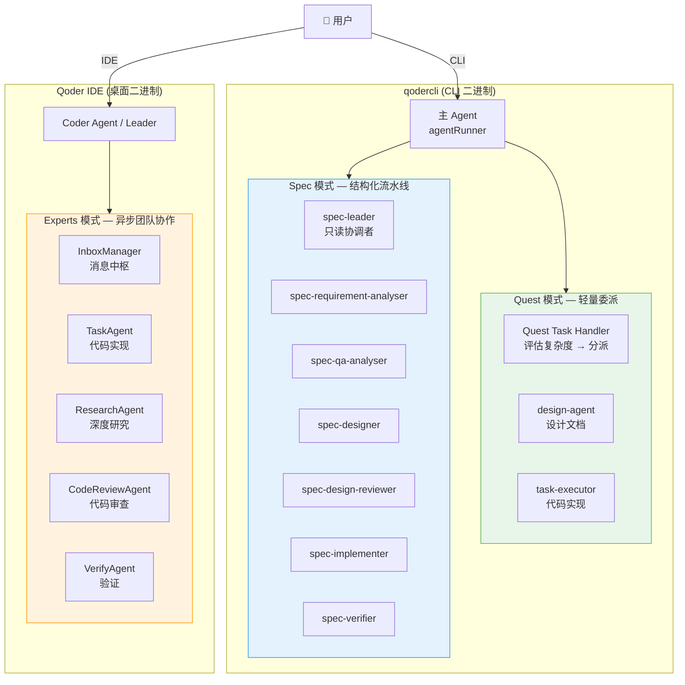
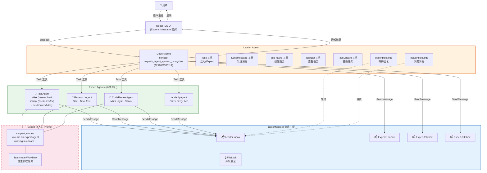
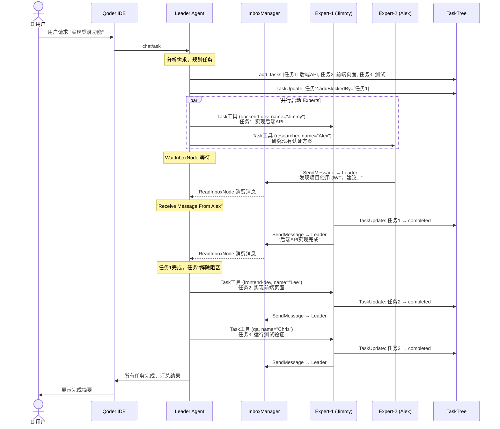
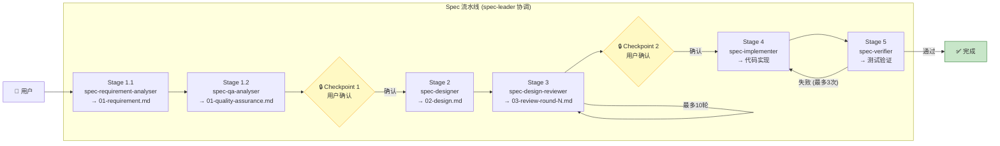
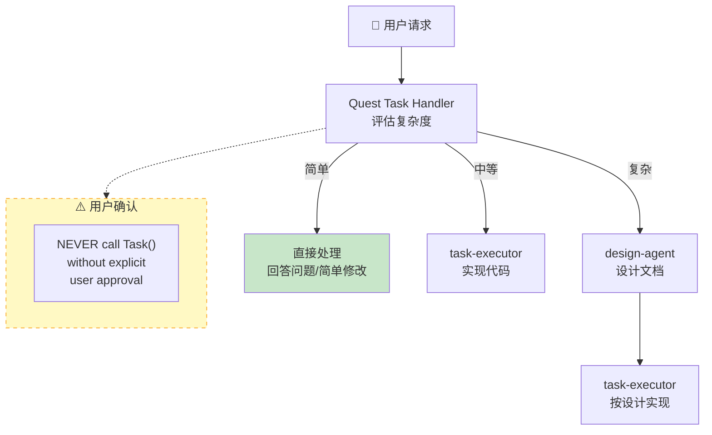
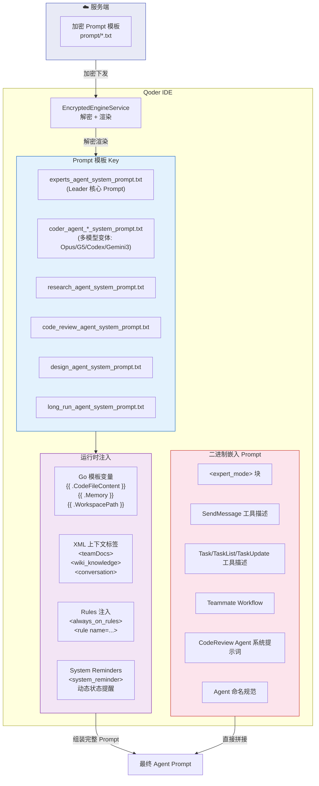
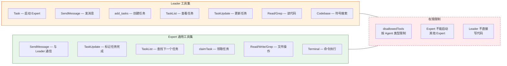
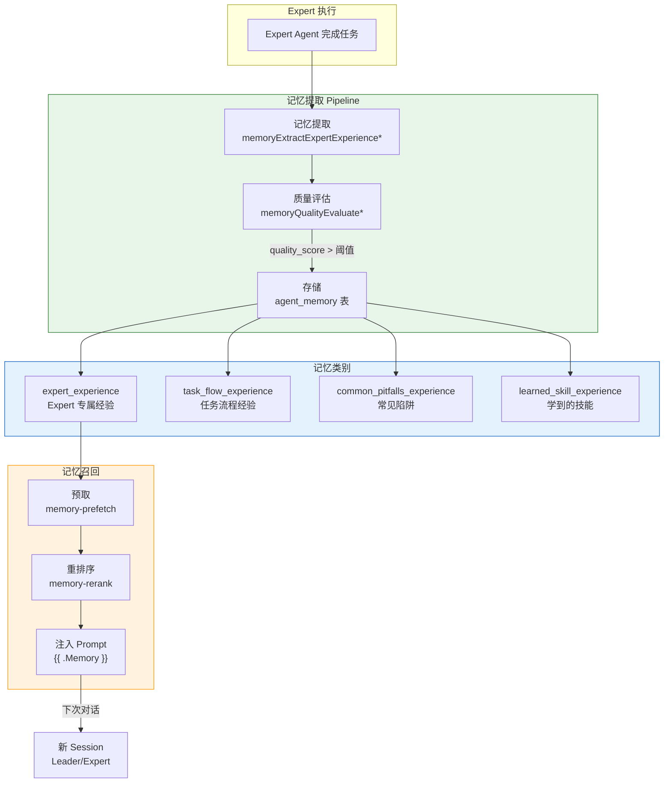

# Qoder 多 Agent 架构 — Mermaid 图集

---

## 1. 全局架构总览：三种编排模式

---

## 2. Experts 模式：Leader-Expert 拓扑与消息流

---

## 3. Experts 模式：任务生命周期时序图

---

## 4. Spec 模式：结构化开发流水线

---

## 5. Quest 模式：智能分派

---

## 6. Prompt 加载与注入架构

---

## 7. Expert Agent 工具集与权限矩阵

---

## 8. 记忆系统与 Expert 经验

---

## 9. 三种模式对比总览

```mermaid
graph TB
    subgraph Quest["Quest 模式"]
        direction TB
        Q1["单层委派"]
        Q2["同步调用"]
        Q3["无状态 Agent"]
        Q4["用户确认后执行"]
        Q5["适合: 中小型任务"]
    end

    subgraph Spec["Spec 模式"]
        direction TB
        S1["5阶段流水线"]
        S2["串行执行"]
        S3["Checkpoint 用户确认"]
        S4["Review 循环 (≤10轮)"]
        S5["适合: 大型功能开发"]
    end

    subgraph Experts["Experts 模式"]
        direction TB
        X1["Leader-Expert 星形拓扑"]
        X2["异步并行执行"]
        X3["Inbox 双向消息"]
        X4["任务依赖 blockedBy"]
        X5["适合: 复杂多文件协作"]
    end

    style Quest fill:#e8f5e9,stroke:#4caf50,stroke-width:2px
    style Spec fill:#e3f2fd,stroke:#2196f3,stroke-width:2px
    style Experts fill:#fff3e0,stroke:#ff9800,stroke-width:2px
```

