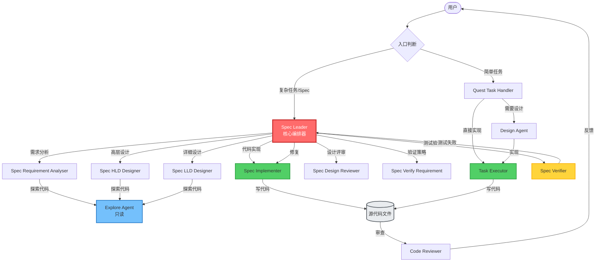
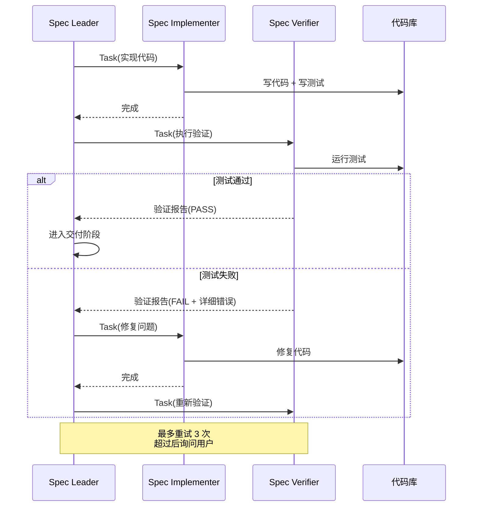
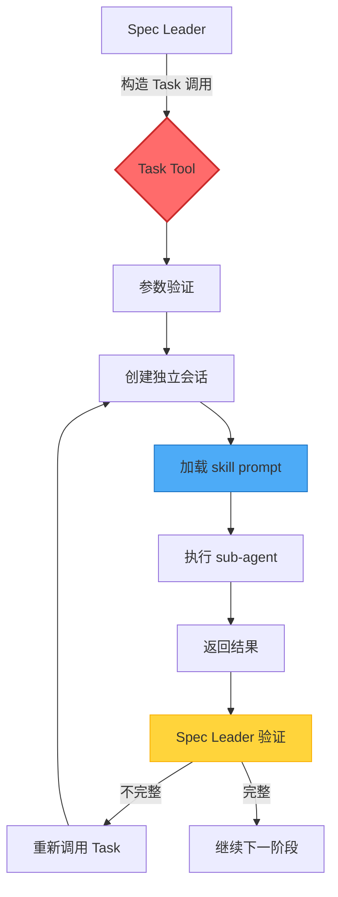
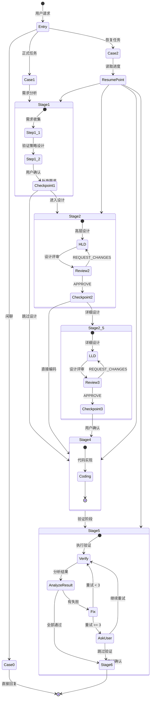
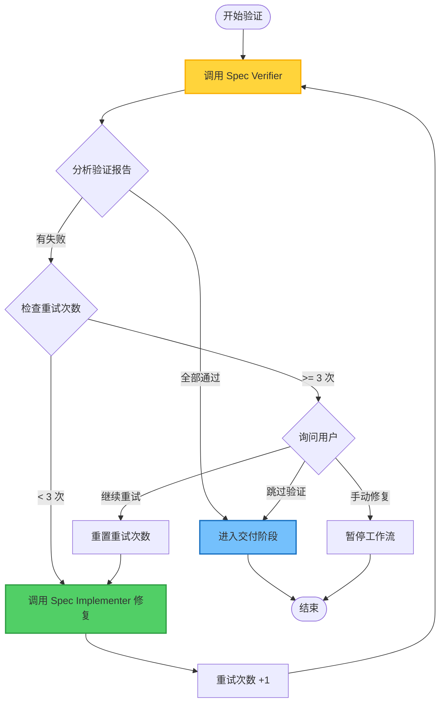

# Qodercli Multi-Agent Architecture

## 架构概览

Qodercli 采用**分层委托式多 Agent 系统**，以 `spec-leader` 为核心编排器，通过 `Task` tool 将工作分发给专门的 sub-agent。每个 agent 有严格的职责边界和权限隔离。

## 核心设计原则

1. **单一职责**：每个 agent 只负责一个明确的任务领域
2. **只读探索**：设计类 agent 只能读取代码，不能修改
3. **唯一写入者**：只有 `spec-implementer` 和 `task-executor` 能写代码
4. **强制验证**：每次 sub-agent 完成后必须验证输出
5. **用户确认**：关键阶段转换需要用户明确批准

---

## 整体架构图



---

## Agent 角色分类

### 1. 编排层 (Orchestration Layer)

#### Spec Leader (核心编排器)
- **职责**：工作流编排、质量控制、阶段确认、进度跟踪
- **权限**：只读 artifacts（需求、设计文档），调度 sub-agents
- **禁止**：直接写代码、修改设计、执行测试、分析代码逻辑
- **调度方式**：通过 `Task` tool，`subagent_type="general-purpose"`

#### Quest Task Handler (智能任务处理器)
- **职责**：处理简单任务请求，智能决策复杂度
- **决策矩阵**：
  - 简单任务 → 直接指导 + task-executor
  - 复杂任务 → design-agent + task-executor
- **特点**：直接与用户交互，等待用户确认后才调用 sub-agent

---

### 2. 需求与设计层 (Requirements & Design Layer)

```mermaid
graph LR
    A[Spec Requirement Analyser] -->|识别任务类型| B{任务类型}
    B -->|分析任务| C[直接输出分析报告]
    B -->|开发任务| D[输出需求文档]
    
    D --> E[Spec Verify Requirement]
    E -->|设计验证策略| F[验证计划文档]
    
    F --> G[Spec HLD Designer]
    G -->|高层设计| H[系统设计文档]
    
    H --> I[Spec Design Reviewer]
    I -->|评审| J{评审结果}
    J -->|REQUEST_CHANGES| G
    J -->|APPROVE| K[Spec LLD Designer]
    
    K -->|详细设计| L[任务分解文档]
    L --> M[Spec Design Reviewer]
    M -->|评审| N{评审结果}
    N -->|REQUEST_CHANGES| K
    N -->|APPROVE| O[进入实现阶段]
    
    style A fill:#4dabf7,stroke:#1971c2
    style E fill:#4dabf7,stroke:#1971c2
    style G fill:#4dabf7,stroke:#1971c2
    style K fill:#4dabf7,stroke:#1971c2
    style I fill:#ffd43b,stroke:#fab005
    style M fill:#ffd43b,stroke:#fab005
```



#### Spec Requirement Analyser (需求分析器)
- **职责**：
  1. 识别任务类型（分析任务 vs 开发任务）
  2. 分析任务：直接输出分析报告
  3. 开发任务：输出结构化需求文档
- **工具**：Grep, Glob, Read（探索代码）
- **输出**：`01-requirement.md` 或 `01-analysis.md`

#### Spec Verify Requirement (验证策略设计器)
- **职责**：基于需求设计测试策略（UT/IT/E2E）
- **输出**：`01-verify-requirement.md`
- **关键**：设计自动化验证方案，确保 AI 可直接执行

#### Spec HLD Designer (高层设计器)
- **职责**：系统架构设计、模块划分、接口定义
- **输出**：`02-high-level-design.md`
- **特点**：探索现有代码库，遵循现有模式

#### Spec LLD Designer (详细设计器)
- **职责**：任务分解、依赖分析、函数级设计、单元测试设计
- **输出**：`04-low-level-design/` 目录，包含任务列表和详细设计
- **粒度**：文件级、函数级、步骤级

#### Spec Design Reviewer (设计评审器)
- **职责**：评审设计文档质量，确保符合需求
- **输出**：`03-high-level-design-review-round-N.md` 或 `05-low-level-design-review-round-N.md`
- **结论**：`APPROVE` 或 `REQUEST_CHANGES`
- **限制**：最多 10 轮评审

---

### 3. 实现与验证层 (Implementation & Verification Layer)



#### Spec Implementer (代码实现器)
- **职责**：根据设计文档写代码、写测试、修复问题
- **权限**：唯一能修改源代码的 spec agent
- **工作流**：
  1. 读设计文档
  2. 实现代码
  3. 写单元测试
  4. 运行编译和 lint
- **输出**：源代码文件、测试文件

#### Spec Verifier (验证器)
- **职责**：执行测试、主动验证、生成验证报告
- **权限**：只读代码，只能执行测试命令
- **禁止**：修改代码、调用 implementer、决定重试
- **输出**：详细验证报告（包含失败原因、根因分析）

#### Task Executor (任务执行器)
- **职责**：执行 tasks.md 中的任务，更新进度
- **权限**：写代码、修改文件、运行命令
- **特点**：系统化执行，逐个完成任务并标记 `[x]`

---

### 4. 辅助 Agent (Auxiliary Agents)

#### Code Reviewer (代码审查器)
- **职责**：审查本地未提交的代码变更
- **检查项**：正确性、安全性、可读性、测试覆盖
- **输出**：审查报告（Critical/Suggestion/Nice to have）

#### Design Agent (设计代理)
- **职责**：完整设计阶段（需求收集 + 设计文档 + 任务分解）
- **特点**：通过 AskUser tool 与用户交互
- **输出**：`design.md` + `tasks.md`

#### Browser Agent (浏览器代理)
- **职责**：通过浏览器工具与网页交互
- **工具**：click, fill, navigate, snapshot, screenshot 等
- **安全**：禁止绕过 CAPTCHA、处理支付

#### Explore Agent (探索代理)
- **职责**：只读探索代码库，理解现有架构
- **权限**：只能使用 Grep, Glob, Read
- **禁止**：修改任何文件

---

## 调度机制详解

### Task Tool 调度协议



### Task Tool 参数结构

```json
{
  "description": "简短描述 (3-5 词)",
  "prompt": "完整任务 prompt，包含:\n- 加载 skill 指令\n- 背景信息\n- 现有 artifacts\n- 当前任务\n- 语言要求",
  "subagent_type": "general-purpose"
}
```

### Prompt 模板

```markdown
Please load the `{skill-name}` skill as a behavioral guide.

## Background Information
[任务上下文]

## Existing Artifacts
- Task Directory: `{{.DataDirName}}/spec/{task-name}/`
- Requirements Document: `{{.DataDirName}}/spec/{task-name}/01-requirement.md`
- Design Document: `{{.DataDirName}}/spec/{task-name}/02-high-level-design.md`

## Current Task
[具体任务描述]

## Language Requirement
Please use [Chinese/English] for all outputs and communication with users.
```

---

## 完整工作流

### Spec Workflow (完整开发流程)



### 关键检查点 (Checkpoints)

1. **Checkpoint 1: 需求 → 设计/编码**
   - 触发：Stage 1 完成（需求 + 验证策略）
   - 选项：进入设计 / 跳过设计直接编码 / 补充需求
   - 必须：用户明确确认

2. **Checkpoint 2: 高层设计 → 详细设计/编码**
   - 触发：高层设计评审通过
   - 选项：进入详细设计 / 直接编码 / 修改设计
   - 必须：用户明确确认

3. **Checkpoint 3: 详细设计 → 编码**
   - 触发：详细设计评审通过
   - 选项：进入编码 / 修改设计
   - 必须：用户明确确认

---

## 验证-修复循环 (Verify-Fix Loop)



---

## Agent 通信协议

### 1. 独立会话原则
- 每次 Task 调用创建新会话
- Sub-agent 无历史记忆
- 必须传递完整上下文

### 2. 上下文传递
```markdown
必须包含：
- 原始需求
- 当前阶段
- 已生成文档位置
- 具体任务描述
- 语言要求
```

### 3. 多模态处理
- Sub-agent 不能直接接收图片
- Spec Leader 分析图片后转为文本描述
- 在 Task prompt 中包含文本描述

---

## 权限矩阵

| Agent | 读代码 | 写代码 | 读 Artifacts | 写 Artifacts | 执行命令 | 调用 Sub-agent |
|-------|--------|--------|--------------|--------------|----------|----------------|
| Spec Leader | ❌ | ❌ | ✅ | ❌ | ❌ | ✅ |
| Requirement Analyser | ✅ | ❌ | ✅ | ✅ (需求文档) | ❌ | ❌ |
| HLD Designer | ✅ | ❌ | ✅ | ✅ (设计文档) | ❌ | ❌ |
| LLD Designer | ✅ | ❌ | ✅ | ✅ (详细设计) | ❌ | ❌ |
| Design Reviewer | ✅ | ❌ | ✅ | ✅ (评审报告) | ❌ | ❌ |
| Verify Requirement | ✅ | ❌ | ✅ | ✅ (验证计划) | ❌ | ❌ |
| Spec Implementer | ✅ | ✅ | ✅ | ❌ | ✅ (编译/lint) | ❌ |
| Spec Verifier | ✅ | ❌ | ✅ | ✅ (验证报告) | ✅ (测试) | ❌ |
| Task Executor | ✅ | ✅ | ✅ | ✅ (tasks.md) | ✅ | ❌ |
| Code Reviewer | ✅ | ❌ | ❌ | ✅ (审查报告) | ❌ | ❌ |
| Explore Agent | ✅ | ❌ | ❌ | ❌ | ❌ | ❌ |
| Browser Agent | ❌ | ❌ | ❌ | ❌ | ✅ (浏览器) | ❌ |

---

## 文件产出结构

```
.kiro/specs/{feature-name}/
├── 01-requirement.md              # 需求文档 (Requirement Analyser)
├── 01-verify-requirement.md       # 验证策略 (Verify Requirement)
├── 01-analysis.md                 # 分析报告 (Requirement Analyser, 分析任务)
├── 02-high-level-design.md        # 高层设计 (HLD Designer)
├── 03-high-level-design-review-round-1.md  # 评审报告 (Design Reviewer)
├── 03-high-level-design-review-round-2.md
├── 04-low-level-design/           # 详细设计目录 (LLD Designer)
│   ├── overview.md                # 任务总览 + 状态跟踪
│   ├── task-01-xxx.md             # 任务 1 详细设计
│   ├── task-02-yyy.md             # 任务 2 详细设计
│   └── ...
├── 05-low-level-design-review-round-1.md  # 详细设计评审 (Design Reviewer)
└── verification-report.md         # 验证报告 (Spec Verifier)
```

---

## 关键约束

### 1. 强制验证 (Mandatory Verification)
```
每次 sub-agent 完成后：
1. 读取输出 artifacts
2. 验证完整性
3. 如不完整 → 立即重新调用 sub-agent
4. 禁止进入下一阶段
```

### 2. 顺序执行 (Sequential Execution)
```
任务编码模式：
- 禁止并行创建多个 Task
- 必须等待当前任务完成
- 按依赖顺序执行
```

### 3. 用户决策权 (User Authority)
```
阶段转换：
- 必须使用 AskUserQuestion
- 提供清晰选项和利弊
- 等待明确确认
- 禁止自动推进
```

### 4. 语言一致性 (Language Consistency)
```
检测用户输入语言 → 全流程使用该语言：
- 所有响应
- 所有文档
- 所有 sub-agent prompt
```

---

## 设计亮点

1. **职责隔离**：设计者不能写代码，实现者不能做架构决策
2. **强制质量门**：每个阶段都有验证机制
3. **可恢复性**：通过状态文件支持中断恢复
4. **可追溯性**：所有决策和评审都有文档记录
5. **用户控制**：关键决策点必须用户确认
6. **自动化优先**：设计时就考虑 AI 可自动执行的验证方案

---

## 与传统 CI/CD 对比

| 维度 | 传统 CI/CD | Qodercli Multi-Agent |
|------|-----------|----------------------|
| 需求分析 | 人工 | spec-requirement-analyser |
| 架构设计 | 人工 | spec-hld-designer |
| 详细设计 | 人工 | spec-lld-designer |
| 代码评审 | 人工 + 工具 | spec-design-reviewer |
| 代码实现 | 人工 | spec-implementer |
| 测试执行 | 自动化 | spec-verifier |
| 修复循环 | 人工 | 自动（spec-leader 编排）|
| 质量门 | 配置规则 | AI 判断 + 用户确认 |

---

## 总结

Qodercli 的多 agent 架构通过**严格的职责分离**和**强制的质量门**，将软件开发的完整生命周期（需求 → 设计 → 实现 → 验证）自动化，同时保持用户对关键决策的控制权。

核心创新：
- **Spec Leader 作为只读编排器**，避免了"上帝 agent"的复杂性
- **验证-修复循环**实现了自动化的质量保证
- **分层设计**（探索 → 设计 → 实现 → 验证）确保了每个阶段的输出质量
- **强制用户确认**在自动化和控制之间取得平衡
